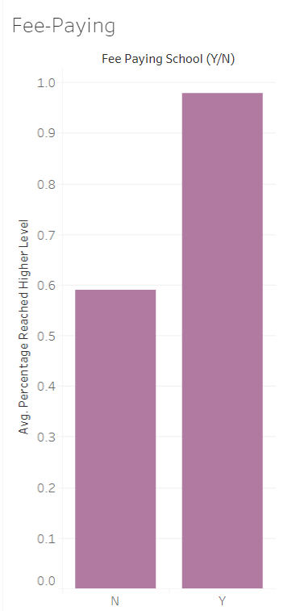
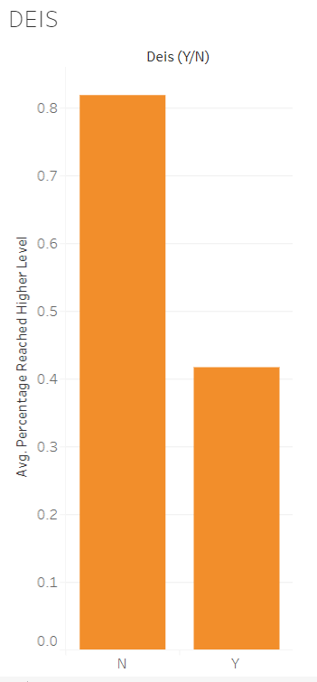

# TLPR_Analysis

[Link to webpage:](https://aoifehoran97.github.io/TLPR_Analysis/)

HEADLINE?

INTRO?

Here is the interactive map with the Average Rent Prices, Average Third-Level Progression Rates and Second-Level School locations in Dublin.

<iframe src="https://www.google.com/maps/d/embed?mid=11Z7C4pZofy8x8XIXdGq5rym34vl6tTBZ" width="1000" height="750"></iframe>

[Link to Tableau Data:](https://public.tableau.com/views/TLPRate/TPLRCharts?:embed=y&:display_count=yes&publish=yes&:origin=viz_share_link)

Scatterplot Screenshot:

FeePaying Barchart Screenshot:

DEIS School Barchart Screenshot:

